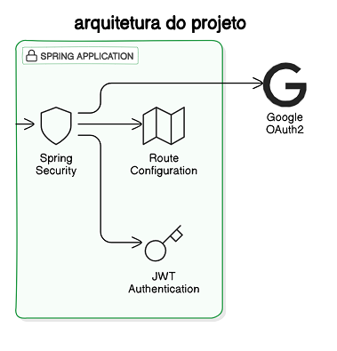

## Spring Security
Estudo sobre o spring security, módulo do spring boot responsável pela implementação de mecanismos de controle de acesso.\
O projeto fazer a autenticação, segurança das rotas, uso do Oauth 2.0 para autorizar o acesso com o Google e o uso de JWT no Resource Server.

 passos:
 -Adição do Spring Security e proteção automática\
 -Configuração da segurança para as rotas\
 -Autenticando no Google com Oauth2\
 -Autenticação com JWT.\

